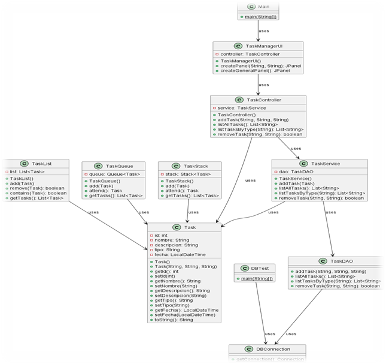
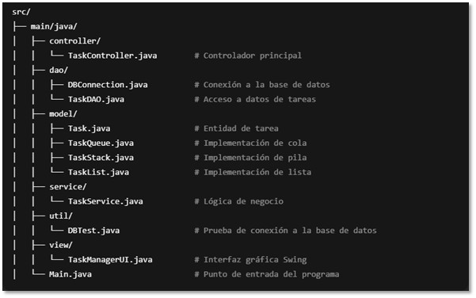
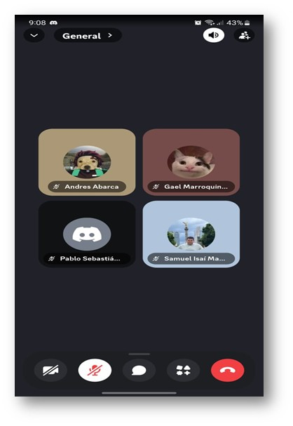

  
  &nbsp;&nbsp;&nbsp;
  

# 🖥️⚙️ Sistema de Gestion de Tareas TechNova

Proyecto académico para la materia de **Estructuras de Datos** - Sistema de gestión de tareas administrativas, marketing y soporte técnico, implementado en **Java**.

🚧 **Estado:** En desarrollo - Documentación y diseño completados, implementación funcional en progreso.

---

## 🧾 INFORMACIÓN DEL PROYECTO

### Datos Académicos
- **Universidad**: TecMilenio
- **Materia**: Estructuras de Datos
- **Profesora**: Blanca Aracely Aranda Machorro
- **Ubicación**: Monterrey, Nuevo León

---

## 📑 ÍNDICE DE CONTENIDO

1. [Descripción del Caso](#descripcion-del-caso)
2. [Solicitudes del Cliente para el Programa](#solicitudes-del-cliente-para-el-programa)
3. [Solución Propuesta](#solucion-propuesta)
4. [Alcance del Programa](#alcance-del-programa)
5. [Roles del Sistema](#roles-del-sistema)
6. [Sistema de Clasificación de Tareas por Prioridad](#sistema-de-clasificacion-de-tareas-por-prioridad)
7. [Tecnologías Usadas en el Proyecto](#tecnologias-usadas-en-el-proyecto)
8. [Arquitectura del Sistema](#arquitectura-del-sistema)
9. [Componentes del Sistema](#componentes-del-sistema)
10. [Diseño UML](#diseno-uml)
11. [Estructuras de Datos Aplicadas](#estructuras-de-datos-aplicadas)
12. [Avance del Proyecto](#avance-del-proyecto)
13. [Glosario de Términos](#glosario-de-terminos)
14. [Bibliografía](#bibliografia)
15. [Conocimientos Adquiridos](#conocimientos-adquiridos)
16. [Desarrolladores](#desarrolladores)
17. [Conclusiones](#conclusiones)

---

## 🔍📝 Descripción del Caso

### Estudio de caso
En TechNova, el equipo de Soporte Técnico detectó que la gestión de tareas presentaba problemas de eficiencia durante los turnos. Mientras algunos técnicos atendían tickets urgentes de clientes con incidencias críticas, otras solicitudes importantes quedaban sin atención o se realizaban en desorden. Por ejemplo, un cliente podía reportar que su servidor estaba caído, mientras que varias solicitudes de mantenimiento menos urgentes también requerían seguimiento.  

Asimismo, los departamentos de Administración y Marketing enfrentaban dificultades similares: los reportes financieros se retrasaban porque los responsables estaban ocupados con tareas imprevistas, y las campañas publicitarias a veces no se ejecutaban a tiempo debido a la falta de un sistema centralizado de gestión de tareas.  

### ❌ Problemática
Desde un enfoque técnico, identificamos que:  
- Las incidencias críticas se mezclaban con tareas regulares, dificultando la priorización basada en urgencia.  
- Cada departamento gestionaba sus listas de tareas de manera independiente, generando duplicidad y pérdida de información.  
- No existía un registro centralizado ni un sistema automatizado de seguimiento, lo que provocaba retrasos y sobrecarga en el personal.
- Una tarea importante de marketing para un lanzamiento podía quedar retrasada porque se registró en una lista sin prioridad.  
- Los supervisores tenían dificultad para generar un resumen confiable de todas las tareas pendientes de cada departamento.

Esta situación generaba confusión, pérdida de productividad y retrasos en la atención a clientes, afectando la eficiencia global de TechNova. Nuestro objetivo es implementar un sistema que permita priorizar, organizar y centralizar las tareas para todos los departamentos, mejorando tanto la experiencia del usuario como el rendimiento del equipo. 

  ### ✅ Beneficios
- Organización eficiente de tareas según prioridad  
- Interfaz amigable y profesional  
- Facilita seguimiento y gestión interna  
- Base para futuras mejoras y persistencia de datos

---

### 📩 Solicitudes del cliente para el programa
- ✅(COMPLETADO) - Programa principal: Implementar un sistema integral de gestión de tareas que centralice la información de todos los departamentos y permita priorización y seguimiento eficiente.  
- ✅(COMPLETADO) - Persistencia de Datos: Implementar un sistema de almacenamiento para guardar las tareas y que no se pierdan al cerrar el programa.  
- ✅(COMPLETADO) - Interfaz Gráfica (GUI): Desarrollar una interfaz gráfica para mejorar la experiencia del usuario, permitiendo una mejor interacción.  
- ⏳(EN PROCESO) - Notificaciones y Recordatorios: Añadir la funcionalidad de notificaciones o recordatorios para tareas urgentes.  
- ✅(COMPLETADO) - Mejorar la Gestión de Usuarios: Agregar un sistema para asignar tareas a diferentes usuarios o equipos dentro de los departamentos.

---

  ### 💡 Solución Propuesta
| Solución | Descripción | Estado |
|----------|-------------|--------|
| 🟢🔴🔵 **Clasificación por colores y triage** | Cada tarea se etiqueta según su nivel de urgencia: Rojo → Urgente / crítica; Verde → Importante / colaborativa; Azul → Regular / ocasional | ✅ Aceptada |
| ☁️ **Uso de base de datos Supabase** | Proponemos almacenar todas las tareas en Supabase, permitiendo sincronización en tiempo real, consultas eficientes y respaldo seguro de la información | ✅ Aceptada |
| 📊 **Registro de avance de tareas** | Permite llevar un seguimiento del progreso de cada tarea, facilitando control interno y reportes de avance | ✅ Aceptada |
| ❌ **Exportación de tareas a CSV** | Permite exportar las tareas a un archivo CSV para reportes o análisis externos | ❌ Denegada (opción futura) |

---

### 📈 Alcance del programa
**Funciones:**
- Registro y clasificación de tareas.
- Asignación de tareas a usuarios y departamentos.
- Control de estados (pendiente, en proceso, completada).
- Reportes básicos de productividad.

**Limitaciones:**
- Reportes estadísticos avanzados  
- Notificaciones externas  

---
## 👥 Roles del Sistema

| Rol | Función Principal | Acceso |
|-----|-----------------|--------|
| Gerente | Supervisar tareas y cerrar el sistema | Panel completo |
| Empleado | Agregar, consultar y atender tareas | Panel principal |

---

## 📊 Sistema de clasificación de Tareas por Prioridad

| Color | Tipo de tarea | Descripción | Tiempos Requeridos
|-------|-------|-------------|--------------------------|
| 🔴 **Rojo** | Urgente | Tareas que requieren un enfoque total | Inmediata |
| 🟢 **Verde** | Colaborativa | Proyectos/Campañas de la empresa | Plazos especificados |
| 🔵 **Azul** | Regular | Tareas diarias y ocasionales | Programable |

---

## 🛠️ Tecnologías usadas en el proyecto

- **Java 17+** - Lenguaje principal de desarrollo  
- **Swing** - Interfaz gráfica  
- **Estructuras de Datos:** Pilas, Colas, Listas  
- **Patrón de diseño:** MVC (Modelo-Vista-Controlador)  

---

## 📂 Arquitectura del Sistema

### Estructura de Capas (MVC)

  

---

### 🧩 Componentes del Sistema

- **Capa de Presentación (View / UI)**  
- 📂 view/ → Contiene las clases de interfaz gráfica del sistema.

- 🖥️ TaskManagerUI.java → Clase principal de la interfaz de usuario:

Muestra tres paneles para gestionar tareas urgentes (pila), tareas regulares (cola) y tareas por departamento (lista).

Permite agregar, atender, eliminar y refrescar tareas desde la interfaz.

Incluye un panel general para visualizar todas las tareas del sistema.

- 🚀 Interfaz.java → Clase auxiliar que puede servir como punto inicial o puente de la UI (si aplica en tu proyecto).

-📍 main.java → Punto de entrada alternativo al sistema, que permite inicializar la interfaz gráfica directamente desde ejecución.

- **Capa de Control (Controller)**
- 📂 `controller/` → Coordina la lógica entre modelo, servicio y vista.  
-⚙️ TaskController.java → Clase principal del controlador:

 Gestiona la creación de tareas enviando los datos a TaskService.

Permite listar todas las tareas o por tipo (pila, cola, lista).

Controla la eliminación o atención de tareas desde la interfaz.

Actúa como intermediario entre la UI (TaskManagerUI) y la lógica del servicio (TaskService).

- **Capa de Lógica de Negocio (Service)**  
  - 📂 `service/` → Implementa la lógica del negocio (manejo de triage/tareas, clasificación, validaciones).
  - ⚙️ TaskService.java → Clase principal que gestiona las tareas
  -⚙️ TaskService.class → Incluye métodos más completos como editTask, toggleCompleteTask y deleteTask con validaciones y confirmaciones.

- **Capa de Acceso a Datos (DAO)**  
  - 📂 `dao/` → Se encarga de la conexión con la base de datos y operaciones CRUD.  
  - 🔗 `DBConnection.java` (o similar) → Clase para gestionar la conexión.
  - ⚙️ TaskDAO.java → Clase principal para las operaciones sobre la tabla tareas

- **Capa de Modelo (Model)**  
  - 📂 `model/` → Clases que representan las entidades principales.
  - 👤 Task.java → Representa una tarea en el sistema.
  - 📝 TaskList.java → Representa una lista de tareas sin orden de prioridad.
  -🚦 TaskQueue.java → Representa una cola de tareas (FIFO – First In, First Out), ideal para tareas regulares.
  -🔴 TaskStack.java → Representa una pila de tareas (LIFO – Last In, First Out), ideal para tareas urgentes.
 
- **Capa de Utilidades (Util)**  
  - 📂 `util/` → Herramientas y clases auxiliares para estructuras de datos personalizadas.  
  - 📌 `cola.java`, `pilas.java`, `listas.java` → Implementaciones de estructuras de datos.
  - 🧪 DBTest.java → Validar que la aplicación pueda conectarse correctamente a PostgreSQL.

- **Otros Archivos Importantes**  
  - 🚀 `main.java` → Punto de entrada alternativo al sistema.    
  - 📄 `readme.txt` → Notas rápidas o documentación básica.  
  - 📦 `lib/` → Librerías externas necesarias para correr el sistema.  
  - 🗂️ `bin/` → Archivos compilados.  

---

## 📊 Diseño UML

### Diagrama de Clases

  

---

## 🎓 Estructuras de Datos Aplicadas

**Pila (Stack):**
- Propósito: Gestionar incidencias críticas  
- Operaciones: `push`, `pop`, `peek`  
- Uso: Priorizar atención inmediata a problemas críticos  

**Cola (Queue):**
- Propósito: Gestionar tareas administrativas y de marketing  
- Operaciones: `offer`, `poll`, `peek`  
- Uso: Procesar tareas en orden de llegada  

**Lista (LinkedList):**
- Propósito: Gestionar tareas generales de departamentos  
- Operaciones: `add`, `remove`, `contains`  
- Uso: Mantener secuencia de tareas por departamento 

---

## 📈 Avance del Proyecto

**✅ Completado:**  
- Análisis de requisitos  
- Diseño de arquitectura MVC  
- Diagramas UML y diseño de clases  
- Implementación de clases `Pilas`, `Colas`, `Listas`  
- Interfaz básica de usuario  

**🔄 En Desarrollo:**  
- Mejoras en validaciones de entrada  
- Guardado y recuperación de datos (futuro)  
- Mejoras en layout de la interfaz  

**📅 Por Hacer:**  
- Pruebas unitarias   
- Optimización y refactorización de código  
- Publicación en GitHub y despliegue 

---

## 📚 Glosario de Términos

### Términos de Gestión de Tareas
- **Incidencia Crítica**: Problema o fallo que requiere atención inmediata, gestionado mediante una **pila (Stack)** para garantizar prioridad máxima.  
- **Tarea Administrativa/Marketing**: Actividad que debe procesarse en orden de llegada, gestionada con una **cola (Queue)** para respetar el flujo FIFO.  
- **Tarea por Departamento**: Actividad específica de un departamento, gestionada mediante **listas (LinkedList)**, permitiendo agregar, eliminar o consultar según necesidad.  
- **Prioridad de Tarea**: Criterio que determina qué tarea atender primero, implementado mediante la posición en la pila o cola y validaciones internas.  

### Términos de Estructuras de Datos
- **Pila (Stack)**: Estructura LIFO (Last In, First Out), usada para incidencias críticas; la última tarea agregada se atiende primero.  
- **Cola (Queue)**: Estructura FIFO (First In, First Out), usada para tareas administrativas y de marketing; la primera tarea en entrar es la primera en atenderse.  
- **Lista (LinkedList)**: Estructura dinámica que permite agregar, eliminar y consultar tareas por departamento de manera flexible.   
- **Complejidad Temporal**: Tiempo que tarda una operación según el tamaño de la estructura de datos; útil para analizar eficiencia de la pila, cola y lista.  

### Términos de Ingeniería de Software
- **MVC (Model-View-Controller)**: Patrón que separa la lógica de negocio, la interfaz y los datos, aplicado en nuestro proyecto para mantener código organizado.  
- **DAO (Data Access Object)**: Patrón para acceder a datos de manera abstracta; en nuestro caso, puede usarse para persistencia futura de tareas en base de datos.  
- **JDBC**: API de Java que permitirá conectarse a bases de datos para almacenar tareas de manera permanente (implementación futura).  
- **UML**: Lenguaje de modelado usado para diagramar clases (`Pilas`, `Colas`, `Listas`, `Interfaz`) y casos de uso del sistema.  

### Abreviaturas Técnicas
- **ED**: Estructuras de Datos  
- **CRUD**: Create, Read, Update, Delete (operaciones que se aplicarán a tareas y registros en base de datos futura)  
- **API**: Conjunto de funciones para interactuar con sistemas o módulos del programa  
- **GUI**: Graphical User Interface, en nuestro caso implementada con **Swing**  
- **FIFO / LIFO**: First In First Out / Last In First Out, principios de funcionamiento de colas y pilas  

---

## 📖 Bibliografía 

### 📚 Referencias Académicas
1. **Cormen, T. H., Leiserson, C. E., Rivest, R. L., & Stein, R. L. (2022).** *Introduction to Algorithms* (4th ed.). MIT Press.  
   _Utilizado para el estudio de algoritmos y estructuras de datos aplicadas en la gestión de tareas._

2. **Weiss, M. A. (2020).** *Data Structures and Algorithm Analysis in Java* (3rd ed.). Pearson Education.  
   _Referencia principal para la implementación de pilas, colas y listas en Java._

3. **Silberschatz, A., Galvin, P. B., & Gagne, G. (2018).** *Operating System Concepts* (10th ed.). John Wiley & Sons.  
   _Consultado para entender conceptos de concurrencia y manejo de procesos en sistemas._

### 💻 Referencias Técnicas
1. **Oracle Corporation. (2024).** *Java SE 17 Documentation: Collections Framework*.  _Documentación oficial de Java para el manejo de colecciones, listas, colas y pilas._

2. **Fowler, M. (2018).** *Patterns of Enterprise Application Architecture* (2nd ed.). Addison-Wesley Professional.  
   _Consultado para aplicar patrones de diseño como MVC en la organización del proyecto._

---

## 🧠Conocimientos adquiridos

### Conceptos de Estructuras de Datos
- **Implementación práctica de pilas, colas y listas** para la gestión de tareas internas y incidencias críticas.  
- **Análisis de complejidad temporal y espacial** de operaciones en Stack, Queue y LinkedList, evaluando eficiencia en escenarios de alta concurrencia de tareas.  
- **Diseño de estructuras de datos eficientes** adaptadas a distintos tipos de tareas: urgentes (Stack), regulares (Queue) y departamentales (LinkedList).  
- **Optimización del rendimiento** mediante selección de la estructura de datos correcta para cada tipo de tarea y flujo de trabajo.  

### Habilidades de Ingeniería de Software
- **Aplicación de patrones de diseño** básicos y buenas prácticas para mantener el código organizado y modular.  
- **Documentación técnica clara y profesional**, incluyendo diagramas UML y explicación de estructuras y flujo de tareas.  
- **Metodología de desarrollo estructurada**, planificando fases de análisis, diseño, implementación y pruebas de manera ordenada.  

### Competencias Interdisciplinarias
- **Comprensión del dominio de gestión de proyectos internos**, adaptando conceptos de priorización a escenarios de trabajo real.  
- **Trabajo en equipo y coordinación** al gestionar múltiples tipos de tareas y usuarios en el sistema.  
- **Comunicación técnica efectiva**, explicando flujos de tareas, estructuras utilizadas y resultados a compañeros o evaluadores.  

---

## 👨‍💻 Desarrolladores  

<table>
  <tr>
    <td width="160" align="center">
      
    </td>
    <td width="160" align="center">
      
    </td>
    <td width="160" align="center">
      
    </td>
    <td width="160" align="center">
      
    </td>
  </tr>
  <tr>
    <td align="center"><b>Andres Abarca</b></td>
    <td align="center"><b>Samuel Martínez</b></td>
    <td align="center"><b>Pablo Núñez</b></td>
    <td align="center"><b>Gael Marroquín</b></td>
  </tr>
</table>

  

---

## 🔚 Conclusiones 
Este proyecto ha permitido integrar conocimientos de programación, estructuras de datos, diseño de software y gestión de procesos internos. Además, ha demostrado cómo los conceptos teóricos pueden aplicarse a un escenario práctico, mejorando la organización y eficiencia de tareas dentro de una empresa.

El desarrollo del Sistema de Gestión de Tareas de TechNova ha permitido aplicar de manera práctica los conocimientos adquiridos en estructuras de datos y programación orientada a objetos. Los principales logros incluyen:

- **Implementación efectiva de pilas, colas y listas**, adaptadas a distintos tipos de tareas: urgentes, administrativas y departamentales.  
- **Optimización del flujo de trabajo**, priorizando incidencias críticas y garantizando que las tareas regulares se procesen en orden de llegada.  
- **Desarrollo de una interfaz gráfica intuitiva**, que permite a los usuarios interactuar con el sistema de forma eficiente y sencilla.  
- **Documentación completa y profesional**, incluyendo diagramas UML, explicación de estructuras de datos aplicadas y casos de uso.  
- **Preparación para futuras mejoras**, como persistencia de datos, reportes automáticos y ampliación de funcionalidades.  

 
