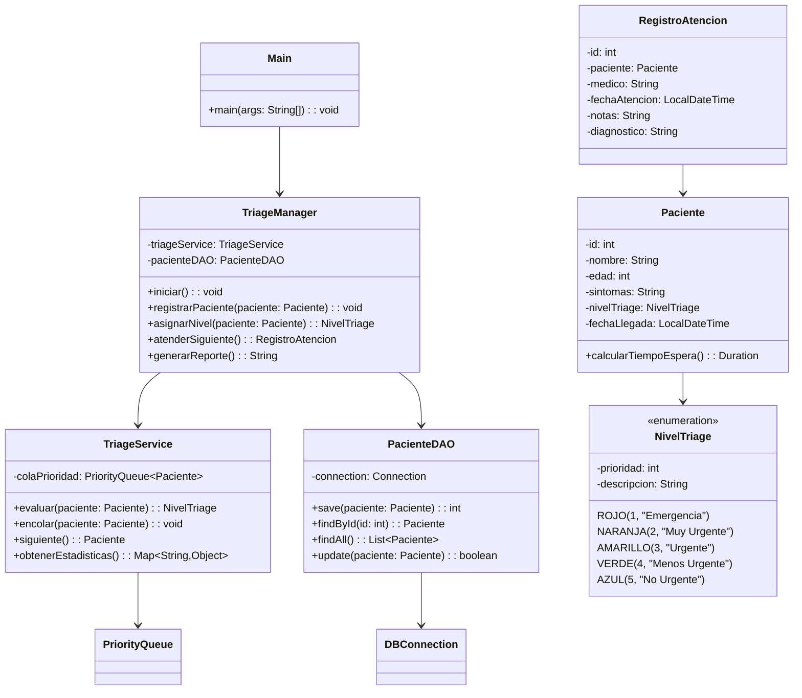
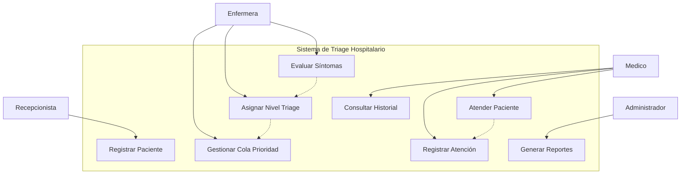

<p align="center">
  
  &nbsp;&nbsp;&nbsp;
  
</p>

# 🖥️⚙️ Sistema de Gestion de Tareas TechNova

**Proyecto académico** para la materia de **Estructuras de Datos** - Sistema de gestión de triage para áreas de urgencias implementado en Java.

> 🚧🛠️ **Estado:** En Desarrollo - Documentación y diseño en proceso, implementación del codigo por finalizar 

---

## 🧾 INFORMACIÓN DEL PROYECTO

### Datos Académicos
- **Universidad**: TecMilenio
- **Materia**: Estructuras de Datos
- **Profesora**: Blanca Aracely Aranda Machorro
- **Ubicación**: Monterrey, Nuevo León

---

## 📑 ÍNDICE DE CONTENIDO

1. [Descripción del Caso](#-descripción-del-caso)
2. [Niveles de Triage](#-sistema-de-niveles-de-triage)
3. [Tecnologías](#️-tecnologías-seleccionadas)
4. [Arquitectura](#-arquitectura-del-sistema)
5. [Diseño UML](#-diseño-uml)
6. [Estructuras de Datos](#-estructuras-de-datos-aplicadas)
7. [Análisis del Problema](#-análisis-del-problema)
8. [Caso de Estudio: Hospital Privado Santa Vida](#-caso-de-estudio-hospital-privado-santa-vida)
9. [Avance del Proyecto](#-avance-del-proyecto)
10. [Glosario](#-glosario-de-términos)
11. [Referencias](#-bibliografía-formato-apa)
12. [Autores](#-desarrolladores)

---

## 🔍📝 Descripción del Caso

### Objetivo General del Proyecto
En TechNova, el equipo de Soporte Técnico notó que constantemente se generaba caos durante los turnos: mientras algunos técnicos atendían tickets urgentes de clientes con problemas críticos, otras solicitudes importantes quedaban olvidadas o se realizaban en desorden. Por ejemplo, un cliente podía reportar que su servidor estaba caído, pero al mismo tiempo llegaban varias solicitudes de mantenimiento que, aunque menos urgentes, también necesitaban seguimiento.
Además, los departamentos de Administración y Marketing enfrentaban dificultades similares: los reportes financieros se retrasaban porque los responsables estaban ocupados con tareas imprevistas, y las campañas publicitarias a veces no se ejecutaban a tiempo por falta de organización. Esto generaba ineficiencia, estrés en el personal y retrasos en la atención a clientes.


### 📩 Solicitudes del cliente para el programa
- ✅(COMPLETADO) - Persistencia de Datos: Implementar un sistema de almacenamiento para guardar las tareas y que no se pierdan al cerrar el programa.
- ✅(COMPLETADO) - Interfaz Gráfica (GUI): Desarrollar una interfaz gráfica para mejorar la experiencia del usuario, permitiendo una mejor interacción.
- ⏳(EN PROCESO) - Notificaciones y Recordatorios: Añadir la funcionalidad de notificaciones o recordatorios para tareas urgentes.
- ✅(COMPLETADO) - Mejorar la Gestión de Usuarios: Agregar un sistema para asignar tareas a diferentes usuarios o equipos dentro de los departamentos.


### 📈 Alcance del programa
**Funciones:**
-Registro y clasificación de tareas.
-Asignación de tareas a usuarios y departamentos.
-Control de estados (pendiente, en proceso, completada).
-Reportes básicos de productividad.


**Limitaciones:**
(POR ESTABLECER)

---

## 📊 Sistema de clasificación de Tareas por Prioridad

| Color | Tipo de tarea | Descripción | Tiempos Requeridos
|-------|-------|-------------|--------------------------|
| 🔴 **Rojo** | Urgente | Tareas que requieren un enfoque total | Inmediata |
| 🟢 **Verde** | Colaborativa | Proyectos/Campañas de la empresa | Plazos especificados |
| 🔵 **Azul** | Regular | Tareas diarias y ocasionales | Programable |

---

## 🛠️ Tecnologías usadas en el proyecto

- **Java** - Lenguaje principal de desarrollo
- **JDBC** - Conectividad con base de datos
- **PostgreSQL/Supabase** - Sistema de gestión de base de datos
- **Estructuras de Datos**:
-   -LinkedList -> Implementa una cola para gestionar tareas en orden primero en entrar, primero en salir.
    -ArrayList -> Ayuda a generar una lista dinámica para almacenar y gestionar las tareas
- **Patrones de Diseño**:
-   -MVC -> Separa la lógica de negocio, interfaz de usuario y control de flujo.
    -DAO -> Abstrae el acceso a datos, facilitando operaciones CRUD con la base de datos.

---

## 📂 Arquitectura del Sistema

### Estructura de Capas (MVC)
```
src/
├── main/java/
│   ├── controller/
│   │   └── TriageManager.java          # Controlador principal
│   ├── dao/
│   │   ├── DBConnection.java           # Conexión a BD
│   │   └── PacienteDAO.java            # Acceso a datos de pacientes
│   ├── model/
│   │   ├── Paciente.java               # Modelo de paciente
│   │   ├── RegistroAtencion.java       # Registro de atención médica
│   │   └── NivelTriage.java            # Enumeración de niveles
│   ├── service/
│   │   └── TriageService.java          # Lógica de negocio
│   ├── util/
│   │   └── PriorityQueue.java          # Cola de prioridad personalizada
│   └── Main.java                       # Punto de entrada
```

### Componentes del Sistema
- **Capa de Presentación**: Interfaces de usuario y controladores
- **Capa de Lógica de Negocio**: Servicios de triage y evaluación
- **Capa de Acceso a Datos**: DAO y gestión de persistencia
- **Capa de Datos**: Base de datos PostgreSQL con esquema médico

---

## 📊 Diseño UML

### Diagrama de Clases


### Diagrama de Casos de Uso


---

## 🎓 Estructuras de Datos Aplicadas

### Cola de Prioridad (Priority Queue)
- **Propósito**: Organizar pacientes según urgencia médica
- **Implementación planeada**: Heap binario para eficiencia O(log n)
- **Criterio de prioridad**: Nivel de triage + tiempo de llegada
- **Operaciones**: Insert O(log n), ExtractMax O(log n), Peek O(1)

### HashMap
- **Propósito**: Búsqueda rápida de pacientes por ID
- **Complejidad objetivo**: O(1) promedio para búsquedas
- **Implementación**: Tabla de dispersión con manejo de colisiones

### LinkedList  
- **Propósito**: Historial de atenciones del paciente
- **Ventaja**: Inserción y eliminación eficiente O(1)
- **Uso**: Mantener secuencia cronológica de eventos

### Enum (NivelTriage)
- **Propósito**: Estandarizar niveles de urgencia médica
- **Ventaja**: Type-safety y mantenibilidad del código
- **Implementación**: Constantes con propiedades asociadas

---

## 🔍 Análisis del Problema

### Problemática Identificada
Los sistemas de urgencias hospitalarias enfrentan desafíos críticos:
- **Sobrecarga de pacientes** en horarios pico
- **Dificultad para priorizar** casos realmente urgentes
- **Tiempos de espera** inadecuados para diferentes niveles de urgencia
- **Falta de trazabilidad** en el proceso de atención

### Requisitos Funcionales
1. **RF01**: Registrar pacientes con datos básicos y síntomas
2. **RF02**: Evaluar automáticamente el nivel de triage
3. **RF03**: Mantener cola de prioridad dinámica
4. **RF04**: Llamar pacientes según urgencia médica
5. **RF05**: Registrar atención médica proporcionada

### Requisitos No Funcionales
1. **RNF01**: Tiempo de respuesta < 2 segundos
2. **RNF02**: Capacidad para 100+ pacientes simultáneos
3. **RNF03**: Interfaz intuitiva para personal médico
4. **RNF04**: Disponibilidad 24/7 del sistema
5. **RNF05**: Seguridad en datos médicos sensibles

---

## 📌 Caso de Estudio: Hospital Privado Santa Vida

El Hospital Privado **Santa Vida**, ubicado en Monterrey, enfrentaba un problema en su área de **Urgencias – Triage**:

- Los pacientes se registraban en una lista general sin diferenciar nivel de urgencia  
- Casos críticos esperaban más de lo debido  
- En emergencias masivas (ej. accidentes viales) no había un mecanismo claro de distribución  
- Faltaba rapidez para consultar expedientes cuando varios médicos atendían en paralelo  

### ❌ Problemática
Esto generaba retrasos, riesgo médico y desorganización en el área de urgencias.

### 💡 Solución Propuesta
Nuestro sistema digital de triage implementa estructuras de datos para optimizar el flujo de pacientes:

- **Pilas (Stack)** → Niveles 1 y 2 (emergencias vitales y severas)  
- **Colas (Queue)** → Niveles 3 y 4 (urgencias moderadas y menores)  
- **Listas (List)** → Nivel 5 (no urgentes)  
- **Tablas Hash** → Identificación rápida y gestión en situaciones de concurrencia  

### 📊 Ejemplo de Flujo
- Carlos (Nivel 1) → Pila de emergencias, atención inmediata  
- María (Nivel 3) → Cola de urgencia moderada  
- Luis (Nivel 5) → Lista de no urgentes  
- Ana (Nivel 2) → Prioridad en la pila sobre casos moderados  

### ✅ Beneficios
- Atención justa y priorizada  
- Orden en la sala de espera  
- Rapidez en emergencias masivas  
- Gestión hospitalaria clara y eficiente  

---


## 👥 Roles del Sistema

### 🏥 Recepcionista
- **Responsabilidades**: Registro inicial de pacientes
- **Funciones**: Capturar datos básicos de identificación
- **Acceso**: Módulo de registro únicamente

### 👩‍⚕️ Enfermera de Triage
- **Responsabilidades**: Evaluación médica y clasificación
- **Funciones**: 
  - Evaluar signos vitales y síntomas
  - Asignar nivel de triage según protocolo
  - Gestionar cola de prioridad
- **Acceso**: Módulos de evaluación y gestión de cola

### 👨‍⚕️ Médico
- **Responsabilidades**: Atención médica directa
- **Funciones**:
  - Atender pacientes según prioridad asignada
  - Registrar diagnóstico y tratamiento
  - Consultar historial médico del paciente
- **Acceso**: Módulos de atención y consulta

### 👨‍💼 Administrador
- **Responsabilidades**: Supervisión y reportes
- **Funciones**:
  - Generar reportes estadísticos del sistema
  - Configurar parámetros de triage
  - Gestionar usuarios y permisos
- **Acceso**: Módulos administrativos y de reportes

---

## 📈 Avance del Proyecto

### ✅ Completado
- [x] **Análisis de requisitos** - Identificación completa de necesidades
- [x] **Diseño de arquitectura** - Estructura MVC definida
- [x] **Diagramas UML** - Clases y casos de uso documentados
- [x] **Definición de estructuras de datos** - Selección justificada
- [x] **Documentación inicial** - README y formato académico
- [x] **Glosario de términos** - Definiciones técnicas y médicas

### 🔄 En Desarrollo
- [ ] **Implementación de clases modelo** (Paciente, NivelTriage, RegistroAtencion)
- [ ] **Desarrollo de cola de prioridad personalizada** con algoritmo heap
- [ ] **Configuración de conexión a base de datos** con Supabase/PostgreSQL
- [ ] **Lógica de evaluación de triage** con algoritmos de clasificación
- [ ] **Interfaces básicas de usuario** para cada rol del sistema

### 📅 Por Hacer
- [ ] **Pruebas unitarias** de estructuras de datos implementadas
- [ ] **Pruebas de integración** entre capas del sistema
- [ ] **Optimización de algoritmos** para mejor rendimiento
- [ ] **Documentación técnica final** con resultados de pruebas
- [ ] **Presentación del proyecto** para evaluación académica

---

## 🚀 Próximos Pasos Técnicos

### Fase 1: Implementación de Modelos (Semana 1-2)
1. **Crear clase Paciente** con validaciones de datos
2. **Implementar enum NivelTriage** con lógica de priorización
3. **Desarrollar RegistroAtencion** para trazabilidad

### Fase 2: Estructuras de Datos (Semana 3-4)
1. **Cola de prioridad personalizada** usando heap binario
2. **HashMap para búsquedas** rápidas por ID de paciente
3. **LinkedList para historial** de atenciones

### Fase 3: Lógica de Negocio (Semana 5-6)
1. **Algoritmos de evaluación** de síntomas
2. **Servicios de triage** con reglas médicas
3. **Controladores** para coordinar operaciones

### Fase 4: Persistencia y Pruebas (Semana 7-8)
1. **Conexión a base de datos** y operaciones CRUD
2. **Testing unitario** de cada componente
3. **Pruebas de rendimiento** del sistema completo

---

## 📚 Glosario de Términos

### Términos Médicos
- **Triage**: Sistema de clasificación de pacientes según la urgencia de su condición médica, originado en medicina militar
- **Signos Vitales**: Medidas básicas de las funciones corporales esenciales (presión arterial, pulso, temperatura, respiración)
- **Urgencias**: Área hospitalaria especializada en la atención inmediata de emergencias médicas y trauma
- **Protocolo Manchester**: Sistema internacional de triage que clasifica pacientes en 5 niveles de prioridad

### Términos de Estructuras de Datos
- **Cola de Prioridad**: Estructura de datos abstracta donde cada elemento tiene una prioridad asociada y se procesan en orden de importancia
- **Heap Binario**: Árbol binario completo que mantiene la propiedad de heap (padre mayor/menor que hijos)
- **Complejidad Temporal**: Medida de la cantidad de tiempo que toma ejecutar un algoritmo en función del tamaño de entrada
- **HashMap**: Estructura de datos que implementa una tabla de dispersión para mapear claves a valores con acceso O(1)

### Términos de Ingeniería de Software
- **DAO (Data Access Object)**: Patrón de diseño que proporciona una interfaz abstracta para acceder a datos
- **MVC (Model-View-Controller)**: Patrón arquitectónico que separa la aplicación en tres componentes interconectados
- **JDBC**: API de Java que define cómo un cliente puede acceder a una base de datos relacional
- **UML**: Lenguaje de modelado unificado para especificar, visualizar y documentar sistemas de software

### Abreviaturas Técnicas
- **BD**: Base de Datos
- **CRUD**: Create, Read, Update, Delete (operaciones básicas de persistencia)
- **ED**: Estructuras de Datos
- **POO**: Programación Orientada a Objetos
- **API**: Application Programming Interface
- **SQL**: Structured Query Language

---

## 📖 Bibliografía (Formato APA)

### Referencias Académicas Principales
Cormen, T. H., Leiserson, C. E., Rivest, R. L., & Stein, C. (2022). *Introduction to algorithms* (4th ed.). MIT Press.

Weiss, M. A. (2020). *Data structures and algorithm analysis in Java* (3rd ed.). Pearson Education.

Silberschatz, A., Galvin, P. B., & Gagne, G. (2018). *Operating system concepts* (10th ed.). John Wiley & Sons.

### Referencias Médicas
Manchester Triage Group. (2014). *Emergency triage: Manchester triage group* (3rd ed.). BMJ Books.

World Health Organization. (2023). *Emergency care systems framework*. https://www.who.int/emergencycare

### Referencias Técnicas
Oracle Corporation. (2024). *Java SE 17 Documentation: Collections Framework*. https://docs.oracle.com/en/java/javase/17/

Fowler, M. (2018). *Patterns of enterprise application architecture* (2nd ed.). Addison-Wesley Professional.

### Fuentes Gubernamentales
Secretaría de Salud de México. (2022). *Norma Oficial Mexicana NOM-027-SSA3-2013, Regulación de los servicios de salud*. Diario Oficial de la Federación.

---

## 🎯 Objetivos de Aprendizaje Alcanzados

### Conceptos de Estructuras de Datos
- **Implementación práctica** de colas de prioridad en contexto real
- **Análisis de complejidad** temporal y espacial de algoritmos
- **Diseño de estructuras** eficientes para problemáticas específicas
- **Optimización de rendimiento** mediante selección adecuada de ED

### Habilidades de Ingeniería de Software
- **Arquitectura por capas** con separación de responsabilidades
- **Patrones de diseño** aplicados a sistemas de información
- **Documentación técnica** completa y profesional
- **Metodología de desarrollo** estructurada y planificada

### Competencias Interdisciplinarias
- **Comprensión del dominio médico** y sus requerimientos críticos
- **Trabajo en equipo** para desarrollo de sistemas complejos
- **Comunicación técnica** efectiva con stakeholders
- **Ética en el manejo** de información médica sensible

---

## 👨‍💻 Desarrolladores  

<table>
  <tr>
    <td width="160" align="center">
      
    </td>
    <td width="160" align="center">
      
    </td>
    <td width="160" align="center">
      
    </td>
    <td width="160" align="center">
      
    </td>
  </tr>
  <tr>
    <td align="center"><b>Andres Abarca</b></td>
    <td align="center"><b>Samuel Martínez</b></td>
    <td align="center"><b>Pablo Núñez</b></td>
    <td align="center"><b>Gael Marroquín</b></td>
  </tr>
</table>

<p align="center">
  
</p>

## 🔚 Conclusiones y Agradecimientos

### Conclusiones del Proyecto
El desarrollo del Sistema de Triage Hospitalario ha representado una experiencia enriquecedora que nos ha permitido aplicar conocimientos teóricos de estructuras de datos en un contexto práctico y socialmente relevante. Los principales logros incluyen:

1. **Comprensión profunda** de la importancia de las estructuras de datos en sistemas críticos
2. **Desarrollo de habilidades** de análisis y diseño de software
3. **Aplicación práctica** de algoritmos de ordenamiento y búsqueda
4. **Sensibilización** sobre la responsabilidad en el desarrollo de sistemas de salud

### Impacto Académico
Este proyecto nos ha permitido integrar conocimientos de múltiples áreas: programación orientada a objetos, bases de datos, ingeniería de software y comprensión del dominio médico, demostrando la naturaleza interdisciplinaria de la ingeniería en sistemas computacionales.

### Agradecimientos
- **Profesora Blanca Aracely Aranda Machorro** por su guía experta y dedicación en la enseñanza de estructuras de datos
- **Personal médico consultado** por compartir su experiencia en procesos de triage hospitalario
- **Universidad TecMilenio** por proporcionar los recursos tecnológicos y el ambiente académico necesario
- **Compañeros de equipo** por su colaboración, compromiso y aportaciones valiosas al proyecto

---

> 📚 **Proyecto Académico TecMilenio** - Estructuras de Datos  
> 🎓 Desarrollado como parte del aprendizaje integral en ingeniería de sistemas
